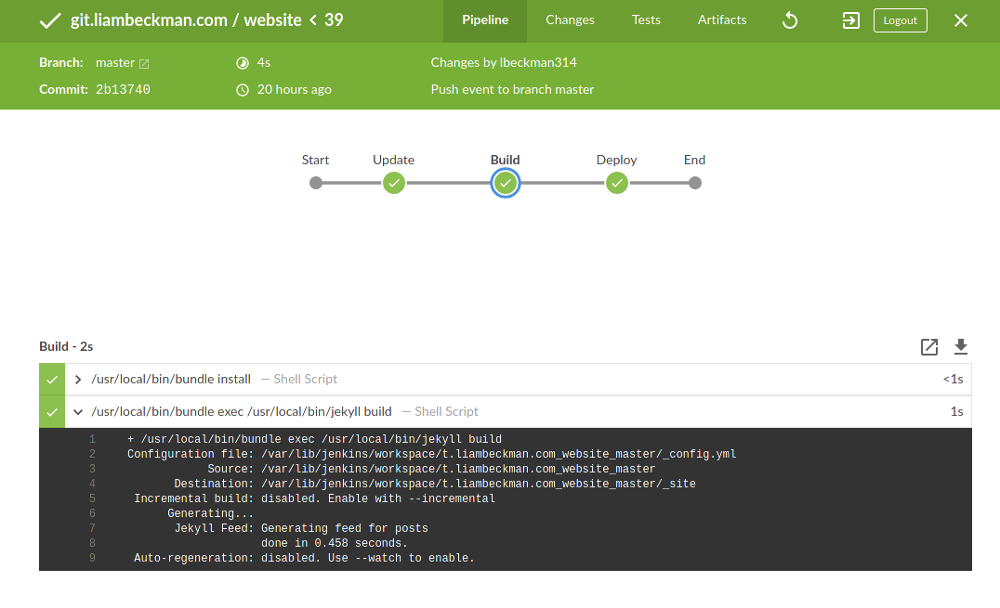

[![Jenkins Badge][badge]][jenkins]

# About

A personal website built with Astro for showing off personal projects, notes, and favorites! 

Previously built with Jekyll, now migrated to [Astro](https://astro.build/) for modern performance and developer experience.

# Building

## Requirements

- [Node.js 18+](https://nodejs.org/): for building the site with Astro.
- [npm](https://www.npmjs.com/): dependency management.
- [Git](https://git-scm.com/): source code management.

## Instructions

Source code can be found [here](https://github.com/lbeckman314/website). To spin up your own site:

```shell
# Clone the repository
git clone https://github.com/lbeckman314/website
cd website

# Install dependencies
npm install

# Start development server
npm run dev

# Now browse to http://localhost:4321

# Build for production
npm run build

# Preview production build
npm run preview
```

## Development

- **Pages**: Located in `src/pages/` - includes homepage, about, notes, code, and favorites
- **Content**: Managed through Astro Content Collections in `src/content/`
  - `notes/` - Blog posts and thoughts
  - `code/` - Project showcases  
  - `favorites/` - Curated recommendations (books, movies, poems, etc.)
- **Components**: Reusable Astro components in `src/components/`
- **Layouts**: Base layouts for different page types in `src/layouts/`
- **Styling**: SCSS files in `src/styles/` with the main styles in `main.scss`
- **Assets**: Static assets (images, js, css) in `src/assets/`

## Migration from Jekyll

This site was successfully migrated from Jekyll to Astro while preserving:
- ✅ All original content and metadata
- ✅ Visual design and styling
- ✅ URL structure and navigation
- ✅ Content collections for notes, code projects, and favorites
- ✅ Responsive design and theme switching

# CI/CD

The website is updated every time a push is made to the `master` branch. Build commands are defined in the [Jenkinsfile](./Jenkinsfile), and build results can be viewed at either of the following URL's.

- [Jenkins (standard)][jenkins]
- [Jenkins (Blue Ocean)][blue]

[][blue]

[jenkins]: https://liambeckman.com/jenkins/job/git.liambeckman.com/job/website/job/master/
[blue]: https://liambeckman.com/jenkins/blue/organizations/jenkins/git.liambeckman.com%2Fwebsite
[badge]: https://liambeckman.com/jenkins/job/git.liambeckman.com/job/website/job/master/badge/icon?

